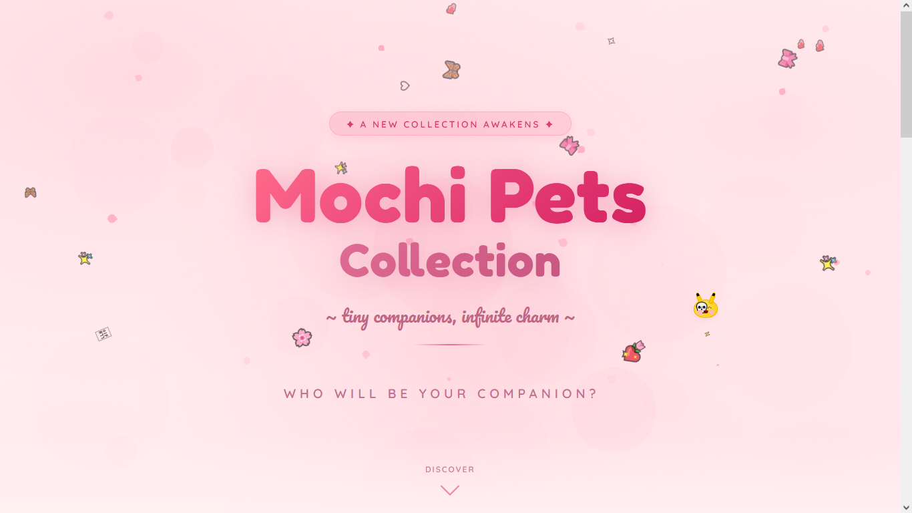

<div align="center">


# 🌸 Mochi Pets Collection

**~ tiny companions, infinite charm ~**

[](LICENSE)
[](https://developer.mozilla.org/en-US/docs/Web/JavaScript)
[](package.json)
[](CONTRIBUTING.md)

*A collection of hand-crafted, self-contained virtual pets that live directly in your browser.*  
*They follow your cursor, express emotions, and scatter particle trails across any webpage — zero setup required.*

[**✨ Live Demo**](https://mahdi2774.github.io/mochis/) · [**📖 Documentation**](#-how-to-adopt) · [**🐾 Browse Pets**](#-meet-the-collection) · [**🤝 Contribute**](#-contributing)

</div>

---

## 📸 Preview

<div align="center">

</div>

---

## 🐾 Meet The Collection

Each Mochi Pet is an independent personality — a unique blend of physics, CSS artistry, and behavioral AI.

| # | Name | Title | Personality | Highlights |
|---|------|-------|-------------|------------|
| 001 | 🌸 **Pinkie** | The Original | Sweet & Gentle | Sparkle trails, blush effects |
| 002 | 🌙 **Munni** | The Shadow | Mysterious | Starlight & golden spark trails |
| 003 | ⚡ **Boys Blue** | The Storm | Energetic | Lightning particles, wind physics |
| 004 | 🌸 **Sakura** | The Bloom | Graceful | Cherry blossom petal trails |
| 005 | 👨‍💻 **AI Drone** | The Debugger | Cold & Precise | Cybernetic design, code particles |
| 006 | 🐱 **Bilai** | The Companion | Wholesome | Whiskers, paws, swishing tail |
| 007 | 💎 **Ayla** | Ultimate Edition | Fully Alive | Sleep · Cry · Exhaust · Joy states |
| 008 | 🎭 **Randomix** | The Shapeshifter | Unpredictable | 3 forms: Cat · Kurumi · Pikachu |

---

## 🚀 How to Adopt

> No installations. No dependencies. No server required.

**Method 1 — From the Collection Site (Recommended)**

1. Visit the [**Mochi Pets Collection**](https://mahdi2774.github.io/mochis/) page.
2. Browse the collection and click any card to **copy its adoption script**.
3. Open any webpage in your browser.
4. Open the Developer Console:
   - **Windows / Linux:** `F12` → Console tab  
   - **macOS:** `Cmd + Option + J`
5. Paste the script and press `Enter`.
6. 🌸 Your companion is now alive.

**Method 2 — Direct Script Paste**

```js
// Example: Adopt Pinkie directly from this repo
// Copy the contents of pets/001-pinkie.js and paste into your browser console
```

> **Note:** Mochi Pets work on virtually any webpage. Sites with strict Content Security Policies (CSP) that block inline scripts may prevent adoption.

---

## 🗂️ Project Structure

```
mochi-pets-collection/
│
├── index.html              # Landing page & collection showcase
│
├── assets/                 # Images, screenshots, banner
│   ├── banner.png
│   └── screenshot.png
│
├── css/
│   └── style.css           # Landing page styles & animations
│
├── js/
│   └── main.js             # Site logic, scroll reveal & script copying
│
└── pets/                   # Self-contained pet payload scripts (IIFEs)
    ├── 001-pinkie.js       # The Original
    ├── 002-munni.js        # The Shadow
    ├── 003-boys-blue.js    # The Storm
    ├── 004-sakura.js       # The Bloom
    ├── 005-ai-drone.js     # The Debugger
    ├── 006-bilai.js        # The Companion
    ├── 007-ayla.js         # Ultimate Edition
    └── 008-randomix.js     # The Shapeshifter
```

---

## 🧠 Architecture & Technical Design

Every Mochi Pet is bundled as a fully self-contained **IIFE (Immediately Invoked Function Expression)** with zero external dependencies. When executed in the browser console, each script independently bootstraps its entire runtime.

### Execution Pipeline

```
Console Paste
     │
     ▼
 Duplicate Guard ──► (if pet already exists, exits gracefully)
     │
     ▼
 Style Injection ──► Appends <style> tag with CSS animations, keyframes & gradients
     │
     ▼
 DOM Construction ──► Programmatically builds pet's element tree
     │
     ▼
 Physics Engine ──► requestAnimationFrame loop with delta-time normalization
     │
     ▼
 State Machine ──► Idle · Following · Petted · Exhausted · Crying · Sleeping
     │
     ▼
 Particle System ──► Efficient, memory-safe DOM particle emitter
     │
     ▼
 Interaction Hooks ──► mousedown · mouseup · mousemove · resize listeners
```

### Core Systems

| System | Implementation |
|--------|---------------|
| **Physics** | Spring-damper kinematics with delta-time normalization |
| **Rendering** | `translate3d` + `will-change` for GPU-composited transforms |
| **State Management** | Finite State Machine (FSM) with smooth CSS transitions |
| **Particles** | Short-lived DOM elements with CSS keyframe animations |
| **Face Tracking** | Lerped gaze direction mapped from cursor delta |
| **Kinematics** | Squash & stretch, ear wiggle, paw paddle via `Math.sin/cos` |
| **Memory Safety** | `setTimeout` cleanup, duplicate instance guards |

---

## ✨ Feature Highlights

- 🎯 **Zero Dependencies** — Pure Vanilla JS + CSS, no frameworks, no build tools
- 🧠 **AI Emotion States** — Ayla features a full FSM: idle, following, petted, exhausted, crying, sleeping
- 🌊 **Smooth Physics** — Delta-time normalized spring kinematics with squash & stretch
- 🎨 **GPU Accelerated** — All transforms use `translate3d` + `will-change` for 60fps rendering
- 💨 **Particle Systems** — Per-pet custom particle emitters with style-aware colors & icons
- 🔒 **Safe Injection** — Duplicate instance guards prevent multiple pets from spawning
- 📱 **Boundary Aware** — Pets respect viewport edges with elastic bounce physics
- 🖱️ **Drag & Throw** — Click-drag pets and toss them with velocity-preserved throws

---

## 🤝 Contributing

Contributions are warmly welcomed! Want to design a new Mochi Pet?

### Creating a New Pet

1. **Fork** this repository.
2. Copy `pets/001-pinkie.js` as your starting template.
3. Customize to your liking:
   - 🎨 Adjust CSS gradients, border colors, and body shapes
   - ✨ Define unique particle arrays (`content`, `color`, `distance`)
   - ⚙️ Tweak physics constants (`SPRING_STIFFNESS`, `FRICTION`, thresholds)
   - 🧠 Add new emotion states or interaction behaviors if desired
4. Test your pet thoroughly on multiple websites.
5. Add your pet's card to `index.html` following the existing pattern.
6. Submit a **Pull Request** with a brief description of your pet's personality.

### Guidelines

- Each pet must be fully self-contained within a single IIFE
- Include a duplicate-instance guard (`if (document.getElementById('your-pet-id')) return;`)
- Clean up all DOM elements and listeners if the pet is removed
- Keep file size reasonable — aim for under 15KB minified

---

## 📋 Browser Compatibility

| Browser | Support |
|---------|---------|
| Chrome 80+ | ✅ Full |
| Firefox 75+ | ✅ Full |
| Safari 14+ | ✅ Full |
| Edge 80+ | ✅ Full |
| Opera 67+ | ✅ Full |

---

## 📜 License

This project is licensed under the **MIT License** — feel free to adopt, modify, redistribute, and share your Mochi Pets anywhere.

See [`LICENSE`](LICENSE) for full details.

---

## 🌸 Acknowledgements

- Fonts: [Google Fonts](https://fonts.google.com/) — Fredoka One, Pacifico, Quicksand
- Physics inspiration: Spring-damper systems from game development literature
- All pets designed, coded, and loved by **IncognitoM**

---

<div align="center">

*Crafted with* ❤️ *and code by* **IncognitoM**

⭐ *If you enjoy this project, consider giving it a star!* ⭐

</div>
